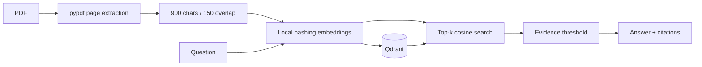

# Evidence-Grounded RAG Document Assistant

FastAPI service for PDF ingestion, page-aware chunking, local deterministic embeddings, Qdrant semantic retrieval, evidence-thresholded answers, and filename/page citations. It refuses to answer when retrieval evidence is weak.



## Features

- PDF upload, listing, deletion, page preservation, and explicit re-indexing
- Free local embeddings with no API credential requirement
- Semantic retrieval and `/debug/retrieval` observability
- Source citations and explicit `Insufficient evidence in the uploaded documents.` fallback
- Upload size/type validation and extractability checks

## Run and evaluate

```bash
pip install -e ".[dev]"
uvicorn rag_assistant.main:app --reload
pytest --cov=rag_assistant
docker compose up --build
```

Use `/docs`, upload a PDF to `POST /documents`, then call `POST /ask` with `{"question":"..."}`. The tests generate a two-page PDF and verify upload → index → question → page citation → deletion.

## Hallucination prevention

Answers are extractive, never based on model memory. A configurable retrieval threshold blocks unsupported responses. Citations expose source and score; the debugging endpoint makes retrieval auditable.

## Skills Demonstrated

Python, FastAPI, AI, RAG, embeddings, vector database design, Qdrant, PDF parsing, semantic retrieval, REST APIs, Docker, Pytest, Git, Linux, and CI/CD.

## Relevance for German Werkstudent Roles

- Demonstrates a privacy-friendly local AI workflow.
- Makes retrieval behavior testable and explainable.
- Addresses hallucination risk with evidence gates and citations.
- Separates ingestion, retrieval, and answer construction clearly.

## Limitations

The free hashing embedder is intentionally lightweight and less semantic than sentence-transformers. Metadata is in-process in this compact release; production should persist it in PostgreSQL and use a Qdrant server. Scanned PDFs require OCR. See `docs/` for decisions and evaluation examples.
