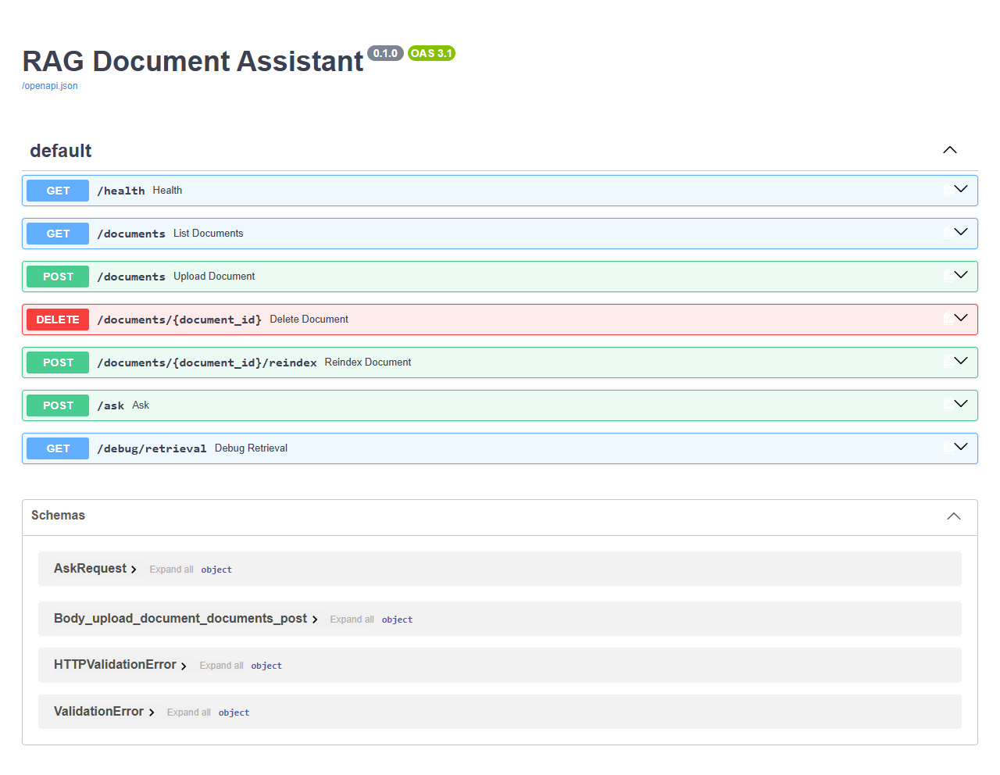
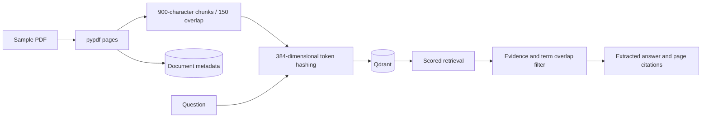

# RAG Document Assistant

Upload PDFs and retrieve source-grounded answers with filename and page citations using a local Python API.



   
[](https://github.com/faizansahi/rag-document-assistant/actions/workflows/ci.yml)

## Overview

A local retrieval and extractive question-answering baseline. It implements PDF ingestion, chunking, deterministic hashed embeddings, vector search, and evidence filtering.

## Business Problem

Finding an answer in a document is useful only if the reader can inspect the supporting source and recognize when evidence is missing.

## Solution

Preserve PDF page numbers, index text chunks in Qdrant, retrieve scored candidates, and construct answers only from qualifying source sentences.

## Key Features

- Upload, list, delete, and reindex text-bearing PDFs.
- Use 384-dimensional hashed token embeddings with normalized cosine search.
- Preserve filename, page, chunk index, and document ID with each vector.
- Filter weak hits before answer construction and return explicit insufficient-evidence responses.
- Persist PDF files, SQL metadata, and local Qdrant data.

## Architecture



[Architecture details](docs/architecture.md) · [Engineering decisions](docs/decisions.md)

## Technology Stack

Python 3.12, FastAPI, pypdf, Qdrant, SQLAlchemy, PostgreSQL/SQLite, Pydantic Settings, ReportLab demo fixtures, Docker Compose, Pytest, Ruff, and GitHub Actions.

## Demo / Results

The live API uploaded a **2-page sample PDF**, created **2 chunks**, retrieved evidence, answered “The safety inspection occurs every Monday.” with a **manual.pdf, page 1** citation, reindexed, refused an unrelated query, and deleted the document. The screenshot above is the running Swagger interface; the full request workflow is saved as JSON.

[Actual output](docs/results/demo.json) · [PostgreSQL container results](docs/results/docker-demo.json) · [Test report](docs/results/tests.txt) · [Provenance](docs/results/provenance.md) · [Verification status](docs/results/verification.md)

Reproduce using a fresh local database and a running API:

```bash
python scripts/evaluate.py
```

## Installation

Requires Python 3.12+. From this repository:

```bash
python -m venv .venv
# Linux/macOS: source .venv/bin/activate
# Windows PowerShell: .venv\Scripts\Activate.ps1
python -m pip install -e ".[dev]"
uvicorn rag_assistant.main:app --reload
```

Open `http://localhost:8000/docs`. With no environment file, the API uses SQLite. See [setup](docs/setup.md).

## Docker Setup

Copy `.env.example` to `.env`, set a unique URL-safe `POSTGRES_PASSWORD`, then run:

```bash
docker compose up --build
```

Compose supplies PostgreSQL and persistent storage. The API binds to localhost port 8000; run one project's stack at a time. Docker was unavailable on the local Windows review machine; [verification status](docs/results/verification.md) records separate container checks.

## Environment Variables

| Variable | Default / requirement | Purpose |
|---|---|---|
| `DATABASE_URL` | `sqlite:///./rag.db` | Metadata database |
| `QDRANT_PATH` | `./qdrant_data` | Local vector-store directory |
| `UPLOAD_DIR` | `./uploads` | Original PDF storage |
| `EVIDENCE_THRESHOLD` | `0.18` | Minimum candidate cosine score |
| `POSTGRES_PASSWORD` | Required for Compose | Local database password |

The app reads `.env`. Compose overrides the database URL with its internal PostgreSQL address. Keep real values out of Git.

## API Usage

Use Swagger or the following examples:

```bash
curl -X POST http://localhost:8000/documents -F "file=@docs/samples/manual.pdf"
curl -X POST http://localhost:8000/ask -H "Content-Type: application/json" -d '{"question":"When does the safety inspection occur?"}'
```

[API / data contracts](docs/api.md).

## Tests

```bash
ruff format --check .
ruff check .
pytest --cov=rag_assistant --cov-report=term-missing
python -m pip check
```

The recorded Windows run passed **8 tests** with **95% statement coverage**. Coverage describes this suite, not complete correctness.  GitHub Actions runs quality and container checks; its badge reports the current status.

## Project Structure

```text
src/rag_assistant/     Application and domain logic
tests/                  Unit and integration tests
scripts/                Reproducible demos and clients
docs/                   Architecture, setup, API, decisions
docs/images/            Real screenshots and output visuals
docs/results/           Execution and test evidence
.github/workflows/      Automated checks
```

## Engineering Decisions

Hashed token vectors offer a deterministic, offline baseline. They represent lexical overlap rather than learned semantic meaning. Extractive answers expose their source; the score threshold and confidence labels are heuristics, not calibrated correctness probabilities.

## Limitations

There is no generative LLM, OCR, authentication, or evaluated semantic embedding model. Hash collisions and irrelevant shared terms can produce poor retrieval. The three stores are not transactionally coordinated; interrupted ingestion/reindexing can require cleanup. Local Qdrant requires a single process/worker. The evidence filter cannot guarantee answer correctness.

## Future Improvements

Evaluate retrieval on a labeled question set, add learned multilingual embeddings, coordinate ingestion recovery, and support authenticated document ownership.

## Skills Demonstrated

Python, Artificial Intelligence application design, RAG, Embeddings, Vector Database integration, retrieval, document parsing, REST API, SQL, Docker, Git, Pytest, and CI/CD checks.

## Relevance for German Werkstudent Roles

Relevant to Werkstudent AI and Backend Development roles: it makes retrieval behavior inspectable and tests source attribution, validation, persistence, and refusal behavior.
