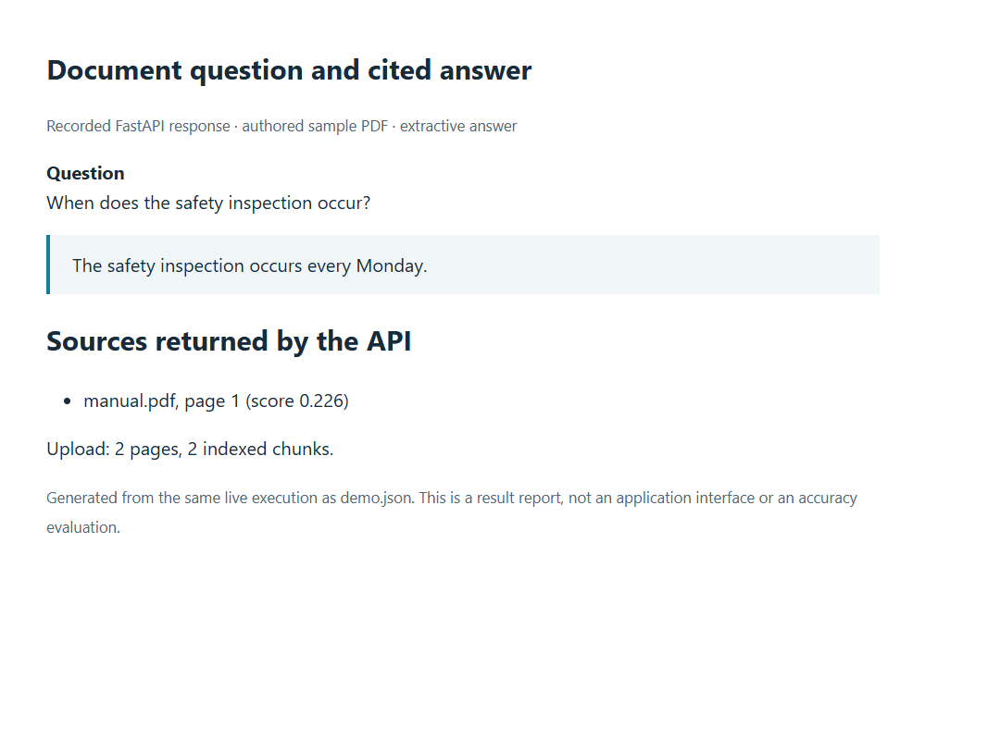

# RAG Document Assistant

Upload PDFs, retrieve relevant passages, and return extracted answers with page citations through FastAPI.

The image is a report rendered from a live API response. The two-page sample manual
says that inspections happen on Monday; the answer cites that sentence on page 1.
The [complete execution record](docs/results/demo.json) includes upload, indexing,
retrieval, reindexing, an unsupported question, and deletion.

## Retrieval before generation

This implementation is an offline retrieval baseline. It uses hashed token vectors
and extractive sentence selection, not a learned embedding model or generative LLM.

~~~mermaid
flowchart LR
  PDF --> Pages[pypdf pages]
  Pages --> Chunks[900 characters / 150 overlap]
  Chunks --> Vectors[384-dimensional token hashes]
  Vectors --> Q[(Local Qdrant)]
  Question --> Vectors
  Q --> Filter[Score and term-overlap filter]
  Filter --> Answer[Source sentences and page citations]
~~~

Chunks stay within page boundaries so citations retain a useful page reference.
Normalized, signed token hashes provide deterministic lexical vectors for cosine
search. Hash collisions are possible, and paraphrases without shared terms can fail.

Retrieval hits below `EVIDENCE_THRESHOLD` (default 0.18) are discarded. The answer
builder selects up to three distinct source sentences with question-term overlap
and includes citations only for the passages it uses. If no sentence qualifies, it returns:

> Insufficient evidence in the uploaded documents.

The threshold and confidence bands are heuristics, not correctness probabilities.

## Try the sample

Use Python 3.12+ in an activated virtual environment.

~~~bash
python -m pip install -e ".[dev]"
uvicorn rag_assistant.main:app --reload
~~~

In another terminal:

~~~bash
python scripts/evaluate.py
~~~

This creates an authored PDF, uploads it to the running server, checks the cited
answer and insufficient-evidence response, reindexes, then deletes the document.
The PDF, JSON responses, and an HTML answer report are saved under `docs/`.
Use a fresh database/vector directory when reproducing the demo.

For your own non-sensitive PDF:

~~~bash
curl -X POST http://localhost:8000/documents -F "file=@manual.pdf"
curl -X POST http://localhost:8000/ask -H "Content-Type: application/json" -d '{"question":"When does the safety inspection occur?"}'
~~~

[Swagger](http://localhost:8000/docs) exposes document listing/deletion, reindexing,
and scored retrieval debugging. Uploads are limited to 20 MB.

## Storage and deployment

SQLAlchemy stores document metadata, Qdrant stores vectors and page text, and the
filesystem retains original PDFs for reindexing. Local defaults are SQLite,
`qdrant_data/`, and `uploads/`; settings can be changed through `.env`.

For PostgreSQL, copy `.env.example` to `.env`, set a unique URL-safe
`POSTGRES_PASSWORD`, then run `docker compose up --build`.
Use one API worker: embedded Qdrant locks its data directory.
Back up metadata, vectors, and source files together.

Python, FastAPI, pypdf, NumPy, Qdrant, and SQLAlchemy form the application.
ReportLab generates the test PDF; it is not part of document parsing.

## Tests and boundaries

~~~bash
ruff check .
ruff format --check .
pytest --cov=rag_assistant --cov-report=term-missing
python -m pip check
~~~

Tests exercise chunk overlap, evidence filtering, upload validation, citations,
reindexing, deletion, and isolated local stores. CI also builds and runs the container
workflow with PostgreSQL metadata. [Executed checks](docs/results/verification.md)
and [test output](docs/results/tests.txt) are recorded separately from the demo.

There is no OCR, authentication, semantic retrieval evaluation, or transaction spanning
the three stores. Interrupted ingestion can need cleanup. The sample proves the workflow,
not broad answer quality. Next work should add an evaluated question set and ingestion
recovery before swapping in learned embeddings or an LLM.

[API](docs/api.md) · [Configuration](docs/setup.md) ·
[Retrieval decisions](docs/decisions.md) · [Sample provenance](docs/results/provenance.md)
