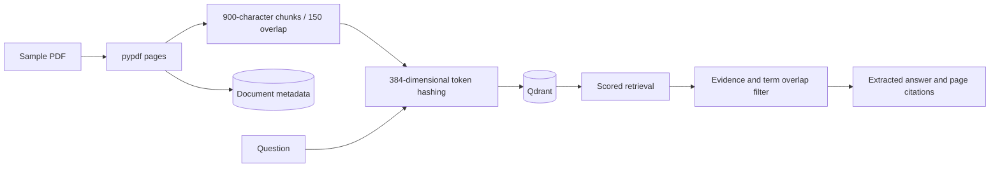

# Architecture

Preserve PDF page numbers, index text chunks in Qdrant, retrieve scored candidates, and construct answers only from qualifying source sentences.

Hashed token vectors offer a deterministic, offline baseline. They represent lexical overlap rather than learned semantic meaning. Extractive answers expose their source; the score threshold and confidence labels are heuristics, not calibrated correctness probabilities.

## Execution boundaries

There is no generative LLM, OCR, authentication, or evaluated semantic embedding model. Hash collisions and irrelevant shared terms can produce poor retrieval. The three stores are not transactionally coordinated; interrupted ingestion/reindexing can require cleanup. Local Qdrant requires a single process/worker. The evidence filter cannot guarantee answer correctness.

Tests use disposable SQLite stores. Live demos use public or fictional input. Container checks use a separate PostgreSQL service. See [execution evidence](results/demo.json) and [verification status](results/verification.md).
