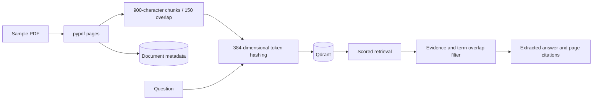

# Architecture

Page numbers stay attached to chunks through vector storage. Questions use the same token-hash function. SQL metadata and original files are stored separately from Qdrant.

See [design decisions](decisions.md) for tradeoffs.
